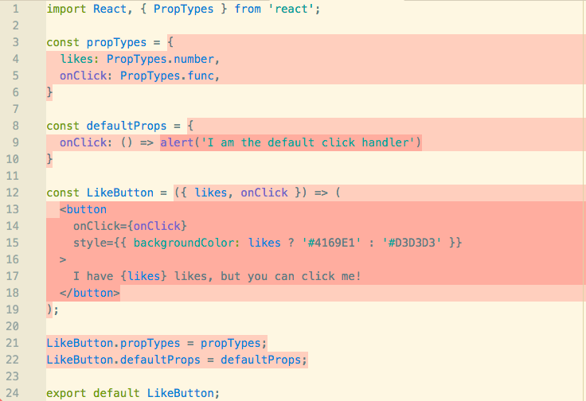

# atom-coverage
> Inline coverage for atom (based on istanbul)

## How to use

Not released yet, so if you want to use it you'll have to clone and `apm link` it.
Then make sure settings path to coverage.json points to your coverage.json file genereated by istanbul.

## Roadmap

Order in no way guaranteed, just what comes to mind right now:

- [x] add support for statement coverage
- [x] add ability to toggle on/off
- [ ] add unit tests
- [ ] release 0.1.0
- [ ] add support for branch coverage
- [ ] add support for function coverage
- [ ] mark hits (calls) in gutter
- [ ] show overall coverage percentage for file somewhere
- [ ] add integration/component/e2e (?) tests
